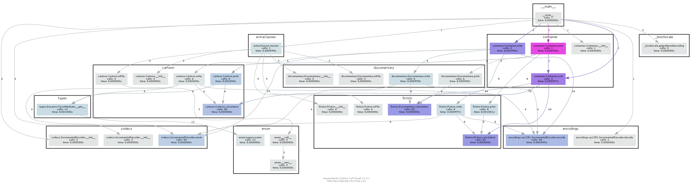

# Третье домашнее задание по предмету "Архитектура Вычислительных систем"

## Задача: Фильмы, Вариант 147 (7, 11)

### Автор: Тасбауова Даяна

## Условие задачи

### Общие для всех альтернатив переменные

* Название фильма – строка символов.
* Год выхода - целое

### Общие для всех альтернатив функции

Частное от деления года создания на количество символов в названии (действительное число)

### Функционал

_После размещения данных в контейнер необходимо осуществить их обработку в соответствии с вариантом задания.
Обработанные данные после этого заносятся в отдельный файл результатов._

Упорядочить элементы контейнера по возрастанию используя сортировку Сортировка с помощью прямого выбора (Straight
Selection). В качестве ключей для сортировки и других действий используются результаты функции, общей для всех
альтернатив.

### Базовые альтернативы

#### 1. Игровой

* наличие, строки символов - режиссёр

#### 2. Мультфильм

* способ создания – перечислимый тип = рисованный, кукольный, пластилиновый

#### 3. Научный

* длительность в минутах – целое

``` 
* Провести отладку и тестирование разработанной программы на заранее
   подготовленных тестовых наборах данных.
   Количество тестовых наборов данных – не менее пяти.
   Число уникальных элементов в тестовых наборах должно варьироваться от нуля до 10000.
   При необходимости, программа должна правильно обрабатывать переполнение по данным.
   Тестовые наборы до 20 элементов должны вводиться из заранее подготовленных тестовых файлов. Тестовые данные с большим числом элементов должны порождаться программно с использованием генераторов случайных наборов данных. Данные, формируемые генератом случайных наборов должны поддерживать допустимые значения. Управление вводом данных задается из командной строки.

* Описать структуру используемой ВС с наложением на нее обобщенной схемы
   разработанной программы.
* Зафиксировать для отчета основные характеристики программы, такие как:
   число интерфейсных модулей (заголовочных файлов) и
   модулей реализации (фалов с определением программных объектов),
   общий размер исходных текстов, полученный размер исполняемого кода (если он формируется),
   время выполнения программы для различных тестовых наборов данных.
* Сделать сравнение между другими реализациями, в чём их отличие и превосходство.   
   ```

Время работы программы на разных размерах входных данных:

Количество фильмов | Время работы, seconds | Потребляемая память, KB
--- | --- | --- 
`10` | `Source: 0.0041, Sorted: 0.0043` |` ~3962`
`100` | `Source: 0.042, Sorted: 0.049` | `~4997`
`1000` |` Source: 1.158, Sorted: 1.84`  | `~8959`
`10000` | `Source: 90.48, Sorted: 161.41` | `~16381`
---

## Разница между процедурной, объектно-ориентированной и динамической реализацией

--------
Самая простая реализация, однако сильно проигрывает во времени строго типизированным языкам.
Динамическая реализация дает довольно высокую цену: во-первых, программа становится медленной, во-вторых, гораздо сложнее отлавливать ошибки.
Потребление времени, и памяти стремится O(N<sup>2</sup>) - след-но он гораздо медленнее, однако легче в использовании (чтение и запись)

## Метрики, определяющие характеристики программы:

| Метрика | Значение |
| :---: | --- |
| Число модулей с реализацией | 6 + 1 (методы рандомизации) |
| Общий размер исходных текстов программы | 18.29 KB |
| Размер исполняемого файла [GCC, Linux] __*__ | 38.77 KB |

__*__ Версии подробнее:

```
$ uname -a
Linux DAYANA-DM3229BB2 5.10.16.3-microsoft-standard-WSL2 #1 SMP Tue June 1 12:45:20 UTC 2021 x86_64 x86_64 x86_64 GNU/Linux

$ g++ --version
g++ (Ubuntu 9.3.0-17ubuntu1~20.04) 9.3.0
Copyright (C) 2019 Free Software Foundation, Inc.
This is free software; see the source for copying conditions.  There is NO
warranty; not even for MERCHANTABILITY or FITNESS FOR A PARTICULAR PURPOSE.

$ lsb_release -a
Distributor ID: Ubuntu
Description:    Ubuntu 20.04.2 LTS
Release:        20.04
Codename:       focal
```

## Сборка полученной программы.

```
python -f "input_file" "output_file_1" "output_file_2"
python -n <number> "output_file_1" "output_file_2"
```

Исполняемый файл программы будет расположен в папке `bin`.

---

## Тестирование

----
Исходные данные для тестирования содержатся в каталоге `tests`.

Файл с результатами прогонов тестов `./reports/...`.

```
./bin/main ./tests/cartoon.txt ./tests/cartoon.out.txt ./tests/cartoon_sorted.out.txt
./bin/main -n 100 ./tests/data/out100.txt ./tests/out100_sorted.out.txt
```
---
## Таблица структуры

---
Я решила сделать таблицу с модуля `pycallgraph` чтобы сделать подробную реализацию вывода структуры таблицы. Сколько памяти занимает и какие методы работают
Весь отчёт находится в папке `./reports/...`. Пример оставляю ниже:
-----


-----